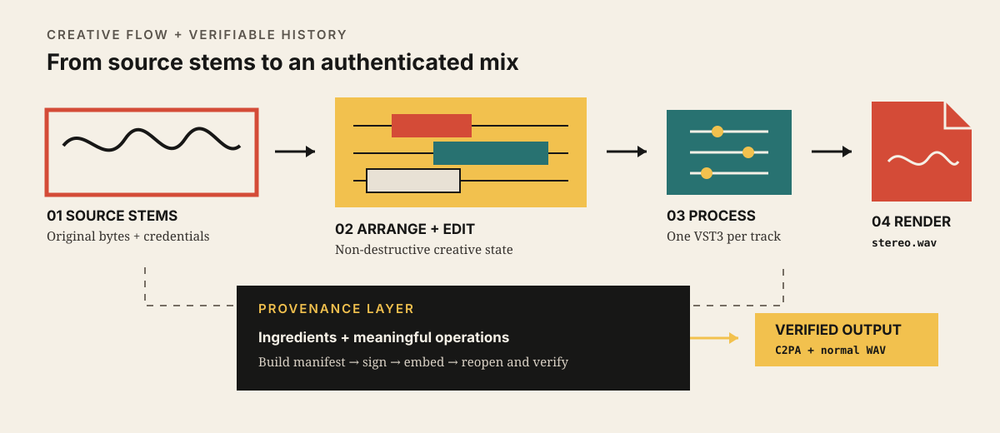

# C2PA Creative Sequencer

A minimal music sequencer for arranging, processing and remixing audio stems while preserving and exporting verifiable C2PA provenance.



The creative path remains primary: imported stems become a non-destructive arrangement, optional track processing contributes to a stereo mix, and a separate provenance layer describes meaningful ingredients and operations before C2PA signing and verification.

## Status

The repository is in version 0.1 proof-of-concept development. PR 001 provides the native macOS application shell, PR 002 adds audio-device configuration and transport, PR 003 adds versioned `.c2paseq` project save/load, and PR 004 adds WAV/AIFF/MP3 stem import, waveforms, and native-speed playback. PR 005 adds the focused Arrangement workspace: persistent Places, musical ruler/grid, reusable tracks, direct clip editing, track controls, navigation, undo/redo, and restoration. VST3 hosting, rendering, and C2PA integration remain planned work and must not be described as implemented yet.

## Product boundary

The product is an arrangement-based audio-stem sequencer, not a full DAW. It will support multiple audio tracks, non-destructive clip editing, constrained VST3 effect hosting, stereo WAV export, and C2PA ingest/export; it will not support recording, MIDI, warping, automation lanes, complex routing, cloud storage, or collaboration.

## Architecture

JUCE owns the native application and UI. The application project model owns canonical clip timing in seconds and edit history, while Tracktion Engine executes the mirrored arrangement for audio-device playback. C2PA code will remain behind a dedicated application service so provenance serialization cannot leak into the audio engine.

See [dependency verification](docs/DEPENDENCIES.md) and [architecture notes](docs/ARCHITECTURE.md).

## Build

The supported POC target is Apple-silicon macOS 13.3 or newer with Xcode 16 or newer and CMake 3.27 or newer.

```sh
cmake -S . -B build -G "Unix Makefiles" -DCMAKE_BUILD_TYPE=Debug -DBUILD_TESTING=ON
cmake --build build --parallel 4
ctest --test-dir build --output-on-failure
open "build/C2PACreativeSequencer_artefacts/Debug/C2PA Creative Sequencer.app"
```

The first configure downloads the exact JUCE and Tracktion Engine revisions recorded in [dependency verification](docs/DEPENDENCIES.md). The CI workflow uses the Xcode generator on GitHub's macOS runner.

## Arrangement controls

Add sample roots with **Places → Add Folder…**, expand their folders, and drag supported audio directly to a track and musical position. Clips snap to beats by default; hold **Option** while dragging to bypass snap. **Space** toggles play/pause at the current playhead, **Command-S** saves, and **Command-Z** / **Shift-Command-Z** undo and redo. Use **Delete**, **Command-D**, and **Command-E** for delete, duplicate, and split-at-playhead; use the **−/+** buttons or Command-scroll to zoom, Shift-scroll to move horizontally, and ordinary scroll to move vertically.

## Known limitations

PR 005 is intentionally an audio-arrangement slice: no recording, MIDI, warping, time stretching, plug-in UI, automation, advanced routing, render/export, or C2PA signing is present. Added Places are machine-local preferences rather than portable project data; imported audio is copied byte-for-byte into the project `Media/` directory, and moving or trimming a clip changes only non-destructive timing metadata. On one track, a later placed or moved clip has playback priority only where it overlaps an earlier clip; different tracks still mix normally.
