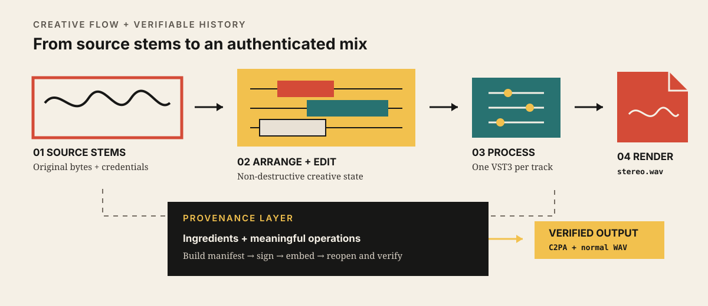

# C2PA Creative Sequencer

A minimal music sequencer for arranging, processing and remixing audio stems, with a staged MIDI v1 foundation, while preserving and exporting verifiable C2PA provenance.

**C2PA Creative Sequencer acts as a C2PA Claim Validator when media enters the creative workflow and a C2PA Claim Generator when the final mix is exported.**



The creative path remains primary: imported stems become a non-destructive arrangement, optional track processing contributes to a stereo mix, and a separate provenance layer describes meaningful ingredients and operations before C2PA signing and verification.

## Status

The repository is in version 0.1 proof-of-concept development. PRs 001–005 provide the native macOS shell, audio transport, project bundles, stem import/playback, and focused Arrangement editing. PR 006 makes source Content Credentials validation automatic on import and makes normal Export a mandatory render → claim → sign → embed → reopen → validate pipeline for stereo 24-bit WAV. PR 008 adds one constrained VST3 audio-effect slot per track. PR 011 adds optional AudioWMark soft-binding authoring; PR 012 adds a separate perceptual-fingerprint binding and extends the same local resolver to demonstrate both discovery methods. Open PR 018 is the umbrella MIDI v1 implementation: its verified foundation checkpoint is complete, while piano-roll editing, VST3 instrument playback, live keyboard input, MIDI recording, and instrument rendering remain planned checkpoints and must not be treated as implemented yet.

## Product boundary

The product is an arrangement-based creative sequencer, not a full DAW. It supports multiple audio tracks, non-destructive clip editing, constrained VST3 effect hosting, stereo WAV export, and C2PA ingest/export. The approved MIDI v1 permits MIDI tracks/clips/notes, beat-based editing, VST3 instruments, laptop-keyboard input, monitoring/recording, instrument playback/rendering, and truthful provenance work. PR 018 delivers that scope through sequential, separately verified checkpoints inside one open pull request; only its track-type, musical-time, persistence, and Audio/MIDI track-creation foundation is implemented at the current checkpoint. Audio recording, warping, time stretching, automation lanes, complex routing, cloud storage, collaboration, CLAP hosting, and full-DAW expansion remain deferred.

## Architecture

JUCE owns the native application and UI. The application project model owns canonical clip timing in seconds and edit history, while Tracktion Engine executes and offline-renders the mirrored arrangement. All SDK access is isolated in `src/provenance`; UI and project code consume only application-owned provenance records and export results.

See [dependency verification](docs/DEPENDENCIES.md), [architecture notes](docs/ARCHITECTURE.md), [MIDI v1 dependency sequence](docs/MIDI_ROADMAP.md), [pull-request visual overviews](docs/pr-overviews/README.md), [soft-binding recovery](docs/SOFT_BINDING.md), and [VST3 hosting](docs/VST_HOSTING.md).

## Build

The supported POC target is Apple-silicon macOS 13.3 or newer with Xcode 16 or newer and CMake 3.27 or newer.

```sh
cmake -S . -B build -G "Unix Makefiles" -DCMAKE_BUILD_TYPE=Debug -DBUILD_TESTING=ON
cmake --build build --parallel 4
ctest --test-dir build --output-on-failure
open "build/C2PACreativeSequencer_artefacts/Debug/C2PA Creative Sequencer.app"
```

The first configure downloads the exact JUCE, Tracktion Engine, `c2pa-cpp`, and macOS arm64 C2PA runtime revisions recorded in [dependency verification](docs/DEPENDENCIES.md). The CI workflow uses the Xcode generator on GitHub's macOS runner.

## Arrangement controls

Add sample roots with **Places → Add Folder…** and expand their folders. Select a supported audio file and click **Preview** to audition it without importing; **Stop** ends audition, starting another preview replaces the first, and dragging/importing stops preview automatically. Preview does not loop or alter arrangement transport, so **Space** remains play/pause for the arrangement. Drag supported audio directly to an Audio track and musical position; clips snap to beats by default, and holding **Option** bypasses snap. Drag a clip's compact header to move it, its edges to trim it, or its waveform body to select time; dragging empty track space also creates a time selection. Time edits are non-destructive: **Command-C/X/V/D** copy, cut, paste, or duplicate the selected clips or selected time fragments, **Command-A** selects all clips, and **Command-L** loops the exact time selection or selected-clip bounds. Paste targets the time selection first, then the insertion point, then the playhead. **+ Track** offers Audio Track or MIDI Track; both receive stable identity, rename/delete behavior, undo/redo, and save/reopen persistence. MIDI tracks are visibly labeled. At the current PR 018 checkpoint there is still no MIDI clip UI, piano roll, instrument, playback, mixer path, or recording; those are explicitly planned later checkpoints in the same open PR and must be verified before they are documented as working. The vector close button deletes a track; populated or plug-in-bearing tracks require confirmation, and the final Audio track is protected. With no selection, **Loop** repeats the full arrangement; the active range is highlighted in the ruler. **Command-S** saves, and **Command-Z** / **Shift-Command-Z** undo and redo. **Delete** removes selected audio clips and **Command-E** splits them at the playhead. Use the zoom buttons, smooth pointer-anchored Command-scroll, or trackpad pinch to zoom; Shift-scroll moves horizontally and ordinary scroll moves vertically.

Each track header includes live gain and pan controls plus a narrow stereo post-processing level meter. Gain and pan update Tracktion's active volume plug-in throughout a drag without replacing the Edit, stopping transport, or moving the playhead; one completed drag becomes one persistent undo step. The meter reflects live signal after the hosted VST3 and track gain/pan, uses peak hold with a readable decay, and returns to silence when playback stops or the track is inaudible through Mute/Solo. Metering is display-only and is excluded from offline export processing.

Imported files are inspected automatically and clips show **CC**, **No CC**, or **CC ?**; select a clip and click **Credentials** for the validation summary. The first **Export** asks for a PEM signing bundle, validates it with `c2pa-cpp`, stores a machine-local copy with restrictive permissions, and continues automatically. Later Finder launches reuse that credential; **Signing** shows configured state and provides replace/remove actions. Normal Export never silently falls back to unsigned WAV, while `C2PASEQ_SIGNING_BUNDLE_PEM` remains a developer-only override.

For the optional PR 011 proof of concept, run `scripts/setup_audiowmark.sh` once, then enable **Audio SB** before export. The app invokes pinned AudioWMark 0.6.5 as an external native process; it embeds one random 128-bit value before C2PA signing, verifies stereo/native-rate/duration/24-bit delivery, and publishes the exact signed manifest bytes plus binding metadata to `~/Library/Application Support/C2PA Creative Sequencer/SoftBindingOutbox/`. Export performs no watermark decode. Recovery belongs to the independent local service in `tools/softbinding-resolver/`; a manifestless derivative remains **No CC** in the Sequencer.

For the PR 012 fingerprint experiment, also run `scripts/setup_audfprint.sh` and enable **FP SB**. When both controls are enabled, export renders, embeds AudioWMark, verifies the audio, fingerprints that final watermarked PCM essence, creates separate C2PA 2.4 soft-binding assertions, signs, validates, publishes, and atomically commits. Start `python3 tools/softbinding-resolver/server.py`; `/watermark` performs embedded-identifier decode plus exact lookup, while `/fingerprint` performs audfprint landmark similarity search. This demonstrates local C2PA soft-binding recovery experiments; a match is association evidence, not proof that the derivative passes the original hard binding.

Each track header has a **+ VST** control. Choose **Scan VST3** explicitly to inspect the standard user and system VST3 folders, then choose one scanned audio effect; the same menu opens its editor, toggles bypass, or removes it. Closing an editor releases it rather than leaving a hidden window active; arrangement edits that rebuild the Tracktion graph also close open editors before replacing their processors. The scan cache is reused at startup, while projects retain plug-in identity, bypass state, and opaque parameter state without copying plug-in binaries. See [VST3 hosting](docs/VST_HOSTING.md) for the exact scope and acceptance procedure.

## Known limitations

The POC still has no audio recording, warping, time stretching, automation, plug-in chains, advanced routing, plug-in sandboxing, or detailed plug-in/edit provenance. At the current PR 018 checkpoint, MIDI note editing, instrument playback, live input, recording, and rendering are planned but not yet implemented. `io.github.jeremybboy.audiowmark.1` and `io.github.jeremybboy.audfprint.1` are experimental project identifiers, not official C2PA SBAL registrations; the resolver is SBR-inspired, not a conformant or production trust service, and recovery never proves the derivative satisfies the original hard binding. Fingerprint matching is probabilistic and can produce false positives or false negatives. The supplied C2PA Conformance credential is a **test credential only**, not the future production identity; external trust recognition depends on the verifier's trust configuration. The private PEM is stored outside projects and Git at `~/Library/Application Support/C2PA Creative Sequencer/Signing/signing-bundle.pem` with mode `0600` inside a `0700` directory. Added Places are machine-local, imported media is copied byte-for-byte into `Media/`, and editing remains non-destructive. On one Audio track, a later clip has priority in overlaps; different Audio tracks mix normally, and export uses that same arrangement.

## Future work

1. **Configurable storage**
   - Replace opaque fixed local demo folders with a user-configurable library/resolver database location.
   - First support a user-selected local folder or a Dropbox-synced folder already mounted by the OS; do not add Dropbox authentication or direct cloud APIs yet.
   - Eventually cover resolver manifests, bindings, fingerprint indexes, and related demo repository state coherently.
2. **Soft-binding scale and ambiguity testing**
   - Watermark path: test approximately 1,000 unrelated registered bindings plus the correct binding, confirm exact resolution of the intended manifest from a transcoded derivative, and record lookup time and ambiguity.
   - Fingerprint path: separately test a larger registered audio corpus for database-size effects, false positives, threshold choice, and lookup performance.
   - Do not treat watermark exact lookup and fingerprint similarity search as equivalent tests.

These items are intentionally deferred from the current proof of concept and should be developed as separate follow-up PRs.


