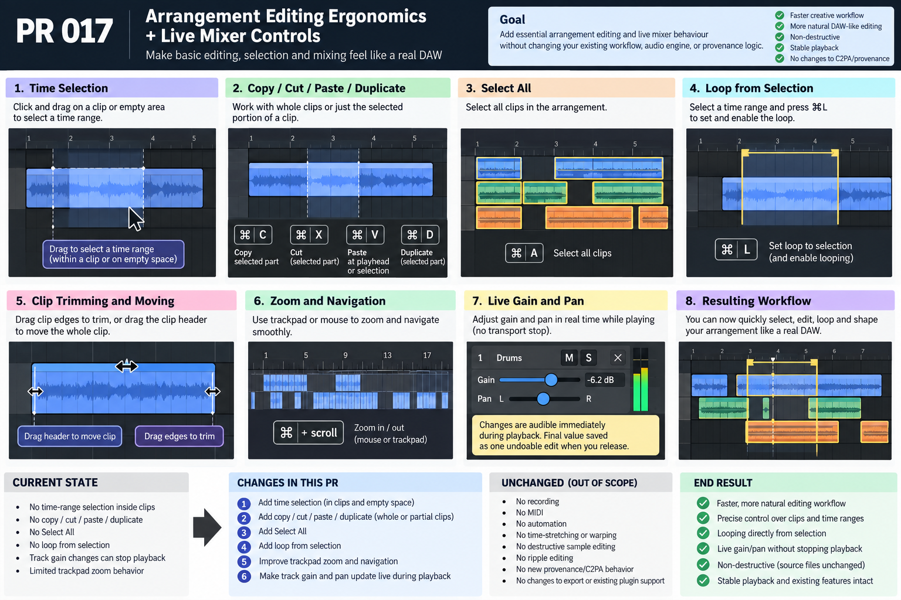

# PR 017 — Arrangement Selection, Clipboard, Looping + Live Mixer Controls

- **Repository:** `jeremybboy/c2pa-creative-sequencer`
- **Base:** current `main` after PR 016
- **Branch:** `pr/017-arrangement-editing-live-mixer`
- **Pull request:** [#17](https://github.com/jeremybboy/c2pa-creative-sequencer/pull/17)
- **Status snapshot:** open for human review on 2026-09-28; do not merge automatically

## Goal

Make essential arrangement selection, partial-clip editing, looping, navigation, and mixer
gestures behave like a focused creative audio tool without expanding the product into a
general-purpose DAW.

## Transparency / change ledger

| Area | PR 017 impact |
| --- | --- |
| Current state | Whole clips could be edited, but there was no explicit time-range selection or partial-range clipboard workflow; track gain/pan edits were not continuous live gestures. |
| User-visible change | Select time inside clips or empty lanes; copy, cut, paste, duplicate, select all, loop the selection, zoom smoothly, and move gain/pan during playback. |
| Code/data layers touched | Arrangement UI, selection and shortcut models, project clipboard/edit transactions, Tracktion live track controls, tests, and documentation. |
| Explicitly untouched | Recording, MIDI, automation, warping, time stretching, ripple editing, consolidation, routing expansion, and destructive source editing. |
| Persistence/undo impact | Cut, paste, duplicate, and each completed gain/pan drag are single undoable actions; final arrangement and mixer values persist in the existing project model. |
| Audio/realtime impact | Gain and pan preview directly through the active Tracktion volume plug-in without rebuilding the Edit or resetting transport. |
| C2PA/provenance impact | No C2PA, export-pipeline, credential, soft-binding, or provenance semantic change. |
| Verification evidence | Release build succeeded, the normal local CTest suite passed 16/16, and GitHub's macOS `build-and-test` check passed on 2026-09-28. External opt-in AudioWMark/audfprint runtime tests were not run. |
| Human acceptance | Still required for pointer feel, audible mixer response, exact loop behavior, trackpad navigation, and save/quit/reopen workflow. |

## Implemented behavior

1. **Time selection** — drag a waveform body or empty arrangement lane to create a snapped,
   bounded time selection; hold Option to bypass snapping.
2. **Clip interaction regions** — drag the compact clip header to move a whole clip and drag
   either edge to retain the existing non-destructive trim behavior.
3. **Clipboard editing** — Command-C/X/V/D operates on whole clips or selected fragments. Partial
   fragments retain media identity, source offset, duration, track relationship, and relative time.
4. **Non-destructive cut** — cutting a middle range leaves left and right source-referencing clips
   with a gap; later material does not ripple.
5. **Select all and text focus** — Command-A selects all arrangement clips, while editable text
   controls retain native Command-A/C/X/V behavior.
6. **Loop from selection** — Command-L enables the exact time selection or the bounding range of
   selected clips; ordinary Loop still covers the full arrangement when nothing is selected.
7. **Timeline navigation** — Command-scroll zooms smoothly around the pointer, JUCE's native
   magnify gesture supports trackpad pinch, and unmodified scrolling retains navigation behavior.
8. **Live mixer gestures** — gain and pan values stream to active processing during a drag without
   stopping playback, resetting the playhead, unloading plug-ins, or creating per-movement undo
   entries; releasing the control persists one edit.

Paste destination priority is: active time-selection start, explicit insertion point, then current
playhead. Copied audio is never rendered, stretched, or written back to its source file.

## Automated verification

Focused regression coverage proves:

- partial copy preserves media identity and the correct source offset and length;
- partial cut produces correct survivors, leaves a gap, and does not ripple later clips;
- partial and whole-clip paste/duplicate placement and properties;
- one-step undo/redo for cut, paste, duplicate, and live mixer gestures;
- exact time-selection loop bounds and bounded clip-body selection;
- gain and pan preview/commit do not stop playback or reset the playhead;
- final gain/pan and arrangement state survive save/reopen;
- existing move, trim, split, occlusion, plug-in hosting, export, and provenance tests remain green.

Final evidence on 2026-09-28: full local Release build succeeded; 16/16 normal tests passed in
32.44 seconds; GitHub's macOS `build-and-test` check also passed. The local build emitted existing
third-party Tracktion conversion warnings but no new project warning or error.

## Manual acceptance before merge

1. Import audio, then verify edge trim, header move, and waveform/empty-lane time selection.
2. Verify partial Command-C/X/V/D, Command-A, undo, and redo without source-file modification.
3. Verify Command-L creates and audibly repeats the exact selected range.
4. Verify ordinary scrolling, Command-trackpad zoom, and pinch feel natural.
5. During playback, drag gain and pan continuously; verify audible change, uninterrupted transport,
   stable playhead, active plug-ins, and responsive meters.
6. Save, quit, and reopen; verify arrangement edits and final mixer values persist.

Do not merge until this human acceptance passes.
