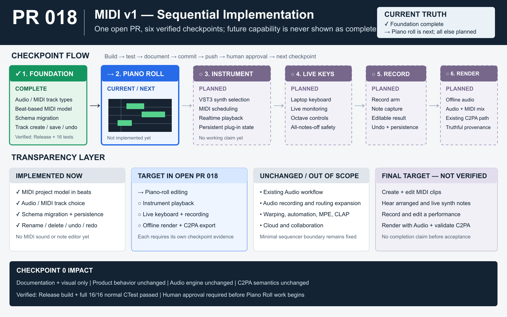

# PR 018 — MIDI Product Boundary + Musical-Time / Track Foundation

- **Repository:** `jeremybboy/c2pa-creative-sequencer`
- **Base:** `main` after PR 017
- **Branch:** `pr/018-midi-foundation`
- **Pull request:** [#18](https://github.com/jeremybboy/c2pa-creative-sequencer/pull/18)
- **Status snapshot:** local automated verification passed on 2026-09-28; open for human review and do not merge automatically

## Goal

Introduce the smallest truthful project-model and UI foundation for a staged MIDI v1 while
preserving the existing absolute-time audio workflow. This PR does not make MIDI audible or
editable in the arrangement.

## Transparency / change ledger

| Area | PR 018 impact |
| --- | --- |
| Current state | Projects contain Audio tracks and second-based audio clips only; there is no MIDI data model or explicit track type. |
| User-visible change | **+ Track** offers Audio Track or MIDI Track; MIDI tracks have a distinct label/color and support rename, delete, undo/redo, and save/reopen. |
| Code/data layers touched | Product boundary, project model, musical-time conversion, project serialization/migration, track creation/deletion UI, tests, and documentation. |
| Explicitly untouched | Piano roll, MIDI clip/note UI, instruments, MIDI playback, input, monitoring, recording, audio recording, tempo maps, MIDI export, and MIDI provenance. |
| Persistence/undo impact | Project schema 2 records explicit track types plus beat-based MIDI clips and notes; legacy schema-1 tracks load as Audio. Track creation/deletion uses the existing undoable project path. |
| Audio/realtime impact | Existing Audio-track processing stays unchanged. MIDI tracks have no audio processor, meter, plug-in, or mixer behavior in this PR. |
| C2PA/provenance impact | No claim, export, credential, soft-binding, or provenance-schema change. |
| Verification evidence | Clean Release configure/build succeeded and the normal local CTest suite passed 16/16 in 33.31 seconds after the final UI correction and empty-MIDI-clip regression coverage. |
| Human acceptance | Local launch verified Audio/MIDI creation, a distinct MIDI row with no fake audio controls, rename, save, and mixed-project reopen. User acceptance remains required for the complete workflow before merge. |

## Implemented foundation

1. **Explicit track types** — each track persists as `audio` or `midi`; track identity remains
   stable and type is never inferred from current contents.
2. **Separate time domains** — Audio clips retain `startSeconds`, `sourceOffsetSeconds`, and
   `lengthSeconds`; MIDI clip and note positions/durations are stored in beats.
3. **Central conversion** — one constant-BPM musical-time converter maps beats to execution
   seconds, leaving a clear replacement boundary for a later tempo map.
4. **MIDI data model** — MIDI clips and notes preserve stable IDs, pitch, beat start, beat
   duration, and velocity without adding a note editor.
5. **Schema migration** — new saves use project schema 2; legacy schema-1 projects with no track
   type load every track as Audio. The separate provenance schema remains version 1.
6. **Track UX** — Audio and MIDI tracks can coexist; MIDI tracks are named sequentially and can
   be renamed or deleted, while unsupported Audio operations are rejected rather than faked.

## Staged follow-up roadmap

- **PR 019:** piano-roll note creation and editing;
- **PR 020:** VST3 instruments, MIDI scheduling, monitoring, and playback;
- **PR 021:** computer-keyboard and external MIDI input;
- **PR 022:** record arm and MIDI recording during transport;
- **PR 023:** instrument rendering in export and truthful provenance semantics.

The detailed boundaries and acceptance criteria are recorded in
[`docs/MIDI_ROADMAP.md`](../../MIDI_ROADMAP.md).

## Manual acceptance before merge

1. Open an existing audio-only project and verify tracks, clips, playback, editing, and export are
   unchanged.
2. Add one Audio track and one MIDI track; confirm their type labels and sequential names.
3. Rename the MIDI track, save, quit, reopen, and confirm order, identity, type, and name persist.
4. Delete the MIDI track and verify undo/redo; verify the final Audio track remains protected.
5. Confirm MIDI rows expose no fake piano roll, instrument, meter, playback, or record controls.

Do not merge until automated verification and this human acceptance both pass.

## Local verification evidence

- clean Release app bundle: `build-pr018/C2PACreativeSequencer_artefacts/Release/C2PA Creative Sequencer.app`;
- 16/16 normal CTest targets passed after the final MIDI-row layout change;
- a temporary schema-2 project preserved five Audio tracks plus renamed MIDI track `Keys`;
- a legacy schema-1 fixture with missing track types loaded as Audio in the project-model test;
- external opt-in AudioWMark and audfprint runtime tests were not run because this PR changes no
  soft-binding behavior.
