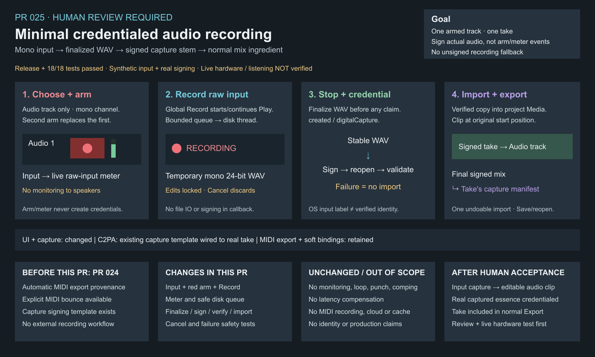

# PR 025 — Minimal credentialed audio recording

Repository: `jeremybboy/c2pa-creative-sequencer`

Base: merged PR 024, `main` at `6f7b511`

Branch: `codex/minimal-credentialed-audio-recording`

Prepared: 2026-10-09; human review and live-input acceptance pending; do not merge automatically.

## Goal

Capture one mono external input on one armed Audio track, then turn its actual finalized WAV
into a signed, validated `digitalCapture` stem before importing it as an ordinary audio clip.
The recorded signed take becomes a normal ingredient in subsequent signed Export.

## Transparency / change ledger

| Layer | Change and boundary |
| --- | --- |
| Current state before this PR | PR 024 automatically credentials MIDI output during signed Export; PR 023 manual bounce remains available; no audio capture workflow. |
| User-visible change | Device/channel selector, single red arm, live raw-input meter, global Record, Stop/finalize, Cancel/discard. |
| Code/data layers | Focused recording service; narrow input adapter; facade/signing orchestration; verified-copy project import; transport/header UI. |
| Persistence / undo | Arm/input/meter are transient session state; successful take import is one ordinary undoable edit, with stable copied media and credentials. |
| Audio / realtime | Callback copies raw mono samples into a bounded disk-writer queue and updates atomic snapshots; no signing, file IO, project mutation, or audio-through in the callback. |
| C2PA impact | Existing human-recorded template, `c2pa.created` / `digitalCapture`, actual capture parameters; no MIDI render actions or inferred performer/device identity. |
| Explicitly untouched | MIDI playback/monitoring, automatic MIDI export, manual bounce, normal ingredient export, watermark/fingerprint parameters and recovery thresholds. |
| Human acceptance | Physical-device enumeration, microphone permission, live meter, listening/placement, Save/reopen and mixed audio/MIDI export still require manual testing. |

## Implemented path

1. Select a device-reported mono input with **Input**, arm an Audio track, and observe its meter.
   A second arm replaces the first; MIDI cannot arm for audio capture. Input opens only on arm.
2. Configure the existing signer and disable Loop; global **Record** starts/continues transport.
   `InputRecordingService` owns a unique temporary mono 24-bit PCM WAV and disk thread.
3. **Stop**, **Record** again, or **Space** detaches capture and flushes/finalizes off the audio
   thread. WAV rate/channel/depth/frame count are verified; changed/stopped input or overflow
   rejects the take. Editing stays locked until completion; finalization is not cancellable.
4. `makeHumanRecordedStemActions` receives `c2paseq:audioCapture`: take ID, track name, actual
   device/channel label and zero-based index, rate/channels/bits, accepted frame count,
   start/end/duration, input mode, WAV encoding, and application name/version.
5. `ProvenanceService::signStemWav` uses the existing signer; the signed result is reopened and
   must contain C2PA with `assetIntact`. `ProjectEngine::importRecordedTake` verifies matching
   capture actions/take ID, copies through `MediaLibrary::copySourceIntoProject`, and only then
   commits the clip at the original start on the original track. Live plugin state is retained.
6. Normal signed Export includes the copied signed WAV as an ingredient. **Cancel/Escape** before
   Stop, capture failure, or signing failure imports nothing and cleans temporary capture files.
   Repeated Stop/Space is ignored during finalization; undo/redo, deletion and project switching
   disarm transient input to avoid a stale recording target.

Arm and meter are not provenance triggers. Input labels are reported by the OS, not certified
microphone or performer identities. The template's historical name does not prove human authorship:
audio playback fed through an input is also digital capture. The captured essence is before track
gain/pan/effects, which still apply normally during playback/export. External trust is distinct
from embedded asset integrity; the supplied signing credential remains test-only.

## Non-goals

No software input monitoring/audio-through, stereo capture, loop or punch recording, comping,
latency compensation, MIDI recording, cloud services, persistent stem cache, production identity,
or automatic regeneration of takes. No unsigned fallback. Input configuration is session-local,
not portable project hardware state. Device reconfiguration on arm can interrupt output; this is
not a sample-accurate, latency-compensated professional recording system.

## Verification snapshot

- Release build succeeded using the existing pinned dependencies in `build-pr021` (folder name
  is historical, not the source version).
- Full CTest: **18/18 passed**, including the new `audio_recording` entry and PR 024 regressions.
- Focused tests: **4/4 passed** — `audio_recording`, `export_pipeline`, `provenance_service`, `plugin_hosting`.
- Synthetic samples exercise the real callback queue and real C2PA signer: single audio arm,
  MIDI rejection, missing signer, loop rejection, raw-input meter, finalized mono/24-bit WAV,
  start position/duration and sample fidelity, capture schema, ingredient export, undo/redo,
  Save/reopen, cancellation and signing/device/queue-overflow failure without unsigned import.
- Bundle `NSMicrophoneUsageDescription` is present; `codesign --verify --deep --strict` passed.
- Whitespace checks and rendered overview visual QA passed. On-screen UI smoke was unavailable because the Mac was locked;
  no live hardware capture or listening acceptance is claimed.

## Manual acceptance / stop conditions

Follow [PR 025 acceptance](../../DEMO.md#pr-025-minimal-credentialed-audio-recording-acceptance).
Do not merge if the input selector fails, the armed meter is silent, output receives unintended
input monitoring, Stop imports unsigned/unvalidated media, Cancel changes project media, or
recorded sound/timing/credentials fail inspection. Include existing MIDI material in the final
mix to verify the normal workflow remains intact; do not broaden scope to solve hardware latency.

## Reviewed workflow

New branch from main → implementation → synthetic/regression tests → Release build → documentation
and synchronized editable visual → explicit-path staging → commit/push → human-reviewed PR.
Generated audio, credentials, app binaries and private test artifacts are not committed.
