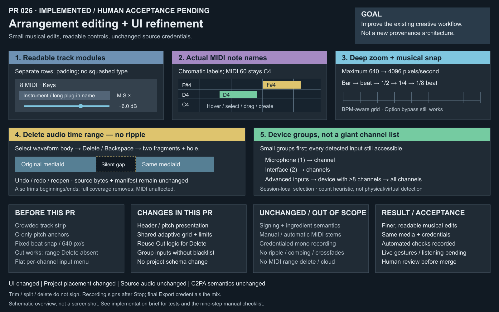

# PR 026 — Arrangement editing and UI refinement

Repository: `jeremybboy/c2pa-creative-sequencer`

Base: merged PR 025, `main` at `e645349`

Branch: `codex/arrangement-editing-ui-refinement`

Prepared: 2026-10-09; human acceptance pending; do not merge automatically.

## Goal and change ledger

One workstation-usability pass, not a new provenance architecture.

| Layer | Implemented change / boundary |
| --- | --- |
| Before this PR | Flat crowded headers, C-only pitch anchors, 640 px/s maximum zoom and fixed beat snapping; Cut already fragments audio, but Delete ignores time selection; flat per-channel input menu. |
| User-visible | Taller readable headers, musical pitch names, deeper zoom/adaptive grid, non-ripple audio range Delete/Backspace, grouped input choices. |
| Code / data | Track header and button typography, piano roll + formatter, shared timeline geometry and persisted zoom limits, existing range-cut logic reused by a new delete API, input-menu presentation. No project schema change. |
| Persistence / undo | Range delete is one undoable project edit; exact layout and deep zoom survive save/reopen. Empty-space deletion creates no history or saved mutation. Input remains session-local. |
| Audio execution | Existing Edit reconstruction and non-destructive source ranges; no new rendering, realtime processing, or monitoring. Delete is rejected during recording/finalization. |
| C2PA | Same mediaId, copied source file and original manifest; no signing for trim/split/range delete. Export still deduplicates source ingredients by media identity. |
| Unchanged | PR 023 manual MIDI bounce, PR 024 automatic MIDI credentials on normal signed Export, PR 025 signed mono recording, watermark/fingerprint behavior. |
| Human acceptance | Live gestures, OS input menus/hardware, real plug-in editing, listening and end-to-end mixed export still require user testing. |

## Implemented behavior

### 1. Readable track modules

Headers are 268 px wide / 116 px tall, with distinct name, plug-in/control, gain and pan rows.
Names truncate with ellipsis rather than horizontal font compression; full names remain in tooltips.
Gain values have wider text boxes. M/S, arm, input, delete, plug-in menu, meter and rename remain.
Toolbar text-button slots are measured from the rendered font, with space reserved for Export's
Cancel label. Compact windows use a smaller natural font; labels are not horizontally compressed.
This corrects the fixed-width toolbar truncation identified during human testing.

### 2. Musical MIDI labels

`midiNoteName` uses C, C#, D, D#, E, F, F#, G, G#, A, A#, B; MIDI 60 stays C4.
All pitch rows label at ≥12 px row height; denser views retain C anchors. Hover identifies the
exact pitch in the header even at dense zoom. Selected/dragged notes show names and MIDI numbers;
new notes are selected and show their creation pitch. Wide/tall enough note blocks show names.
This does not change piano-roll timing or the existing note clipboard/velocity behavior.

### 3. Shared musical grid and deep zoom

Maximum timeline zoom increases from 640 to 4096 px/s, retaining pointer anchoring and persistence.
Rendered grid and snap use the same BPM-aware steps:

| Pixels per beat | Grid step | At 120 BPM |
| --- | --- | --- |
| <24 | 4 beats / bar | 2 s |
| 24–<48 | 1 beat | 500 ms |
| 48–<96 | 1/2 beat | 250 ms |
| 96–<192 | 1/4 beat / sixteenth note | 125 ms |
| ≥192 | 1/8 beat / thirty-second note | 62.5 ms |

Zoom status shows the current step. Arrangement placement/seek/selection/audio trim and MIDI
clip placement/trim share the grid; MIDI clip minimum duration remains its existing quarter beat.
Audio trim's UI floor drops from 50 ms to 2 ms (already shorter valid clips are retained), so it
does not block short musical steps. Source bounds may clamp an edge off-grid, and Option still
bypasses snap; this is not millisecond-perfect accounting or sample-accurate free editing.

### 4. Non-ripple audio range deletion

Drag a waveform body or empty lanes to select time, then Delete/Backspace. All overlapped Audio
clips within the selected lane span are edited; MIDI clips remain untouched. Middle deletion
leaves two fragments and a hole; beginning/end overlap trims; full coverage removes; empty/outside
coverage is a no-op. No clipboard mutation. Whole-clip Delete still works without a time range.

The left fragment retains original start/offset, ending at deleteStart. The right starts at
deleteEnd and advances its source offset by `deleteEnd - originalClipStart`. Both retain mediaId
and source reference; a second surviving fragment gets a new **clip** ID, not a new media/manifest ID.
Fragments ≤1 ms are removed; invalid/non-finite ranges are rejected. Existing source-range
validation and rollback remain in the normal edit path. Later material never ripple-moves.

No new C2PA claim/action is created by split, trim or range delete. Recording signs after
stop/finalize; final Export creates final media credentials using original signed sources.

### 5. Grouped recording inputs

Input device submenus are ordered by channel count. Groups above eight channels are under
**Advanced inputs**; every channel remains accessible. Current input has a checked top-level
entry and checked group/channel. Matching uses device name + channel index, not enumeration order.
No device-name blacklist, physical/virtual certification, project hardware persistence or search UI.
Channel count is explicitly a presentation heuristic: a large physical interface is also Advanced.

## Verification

- Release build passed using the existing pinned dependencies in `build-pr021`; the historical
  build-folder name is not the app's source version.
- Full CTest: **19/19 passed**; focused: **6/6 passed** — `arrangement_editing`, `ui_refinement`,
  `export_pipeline`, `audio_recording`, `plugin_hosting`, `provenance_service`.
- Range cases: middle, beginning, end, full, outside/no undo entry, tiny survivors, invalid/negative/
  non-finite/out-of-track ranges, exact media/offset math, undo/redo, deep zoom + save/reopen,
  multi-clip/multi-track deletion, later material unmoved and MIDI unaffected.
- Real signed synthetic take: trim/split/delete preserve SHA-256 and original manifest/media count;
  exported fragments contribute one original ingredient, validated mix credentials, nonzero audio
  on each side and numerical silence in the deleted interval.
- Existing test VST3 covers manual signed MIDI bounce and automatic MIDI signed Export;
  the mono recording callback/queue/sign/import regression also passes. No Surge XT listening claim.
- Formatter tests span C/C#/D/F#/A#/B across octaves, C4=60 and MIDI limits; adaptive grid tests
  cover 40/120/127/240 BPM, negative clamping, snap idempotence, maximum/minimum zoom and anchoring.
- Grouping tests retain all 67 synthetic input entries, compact microphone/interface groups,
  collapsed 64-channel source and selected-input identity after enumeration reorder.
- Actual toolbar/header/piano-roll components were rendered offscreen and visually inspected;
  toolbar label fit and total width are checked at 1040 and 1280 px, including Export/Cancel,
  and visible header child bounds are checked. The editable SVG/PNG overview was inspected too.
- `git diff --check` and bundle `codesign --verify --deep --strict` passed.
- Live native UI inspection was unavailable while the Mac was locked. Physical input enumeration,
  real plug-in listening, gestures and mixed end-to-end manual acceptance remain pending.

## Manual acceptance / stop conditions

Use [the nine-step acceptance checklist](../../DEMO.md#pr-026-arrangement-editing-and-ui-refinement-acceptance).
Do not merge if header controls become unusable, note names/octaves are wrong, the grid mismatches
snapping, deletion ripples/changes source credentials or clips fail after reopen, input channels
vanish, or recording/manual bounce/automatic MIDI export regress. Do not widen scope to fix
hardware latency or add recording monitoring.

## Non-goals

No new provenance architecture or action templates, destructive audio, ripple editing, comping,
crossfades, transient/pitch editing, MIDI time-range delete, monitoring, production credentials,
cloud services or permanent hardware filtering. Generated WAVs, credentials, builds and private
UI-test renders are not committed.
